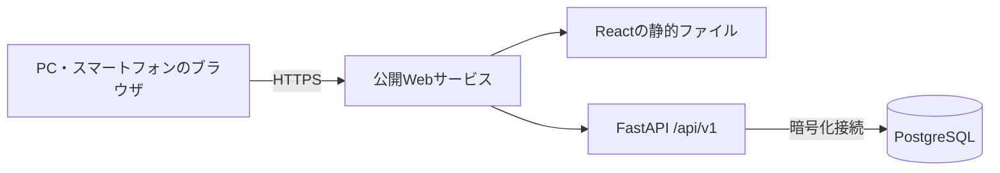
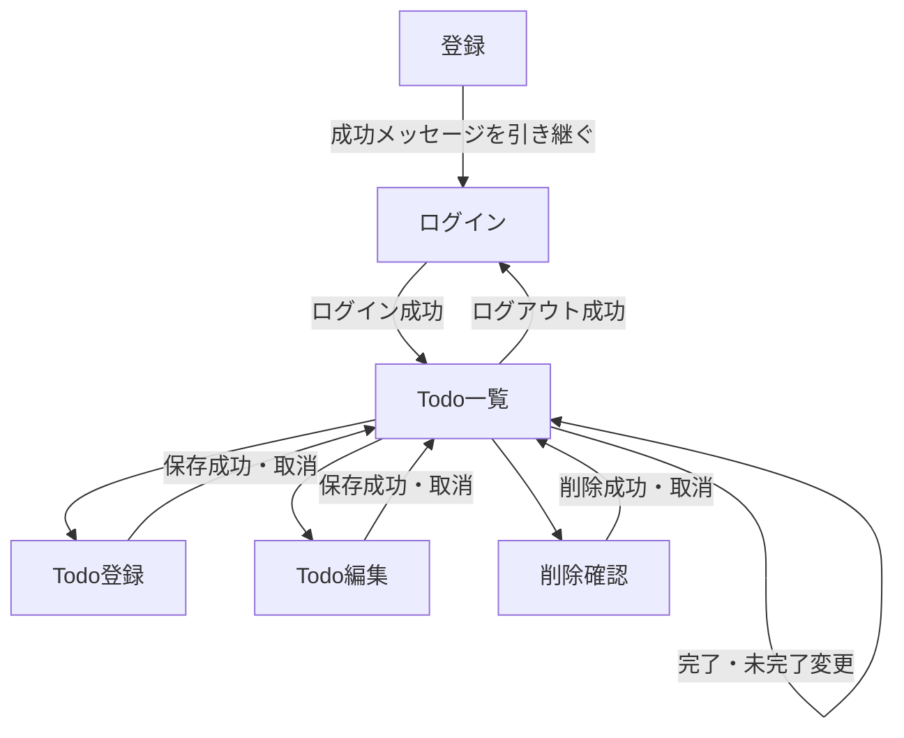
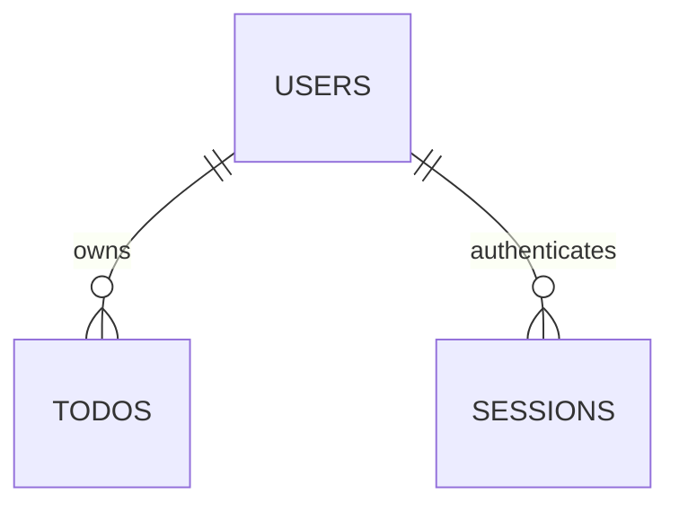

# Todo Webアプリケーション システム設計

## 本書の位置付け

- 確定済みの[REQUIREMENTS.md](REQUIREMENTS.md)を要件の基準とする。
- 2026-09-22にユーザーが確定した設計判断と、先行する設計案を統合する。
- 2026-10-04までにREQUIREMENTS.mdへ反映された利用者向け仕様・受入条件を確定済みとして扱う。利用者要件はREQUIREMENTS.md、実現方法・内部設計は本書を基準とする。
- 本書は設計文書であり、実装済み・テスト済みを意味しない。SQL、Migration、アプリケーションコード、Docker・CI設定は本書の作成対象外とする。
- 要件IDはREQUIREMENTS.mdに定義されたものだけを参照する。具体的な設計判断は既存要件の実現方法として記載し、新しい要件IDは作らない。
- 明示した未決定事項を除き、本書を実装の基準とする。利用者向け仕様の追加・変更が必要な場合は、末尾の「要件定義へのフィードバック」に記録する。

## 1. システム全体構成

対応要件：REQ-NF-001、REQ-NF-003、REQ-NF-008、REQ-SEC-006、REQ-P-002。

React・TypeScript、Python・FastAPI、PostgreSQLを使用する単一アプリケーションとする。
本番ではReactのビルド済み静的ファイルとFastAPIを同一オリジンで公開し、APIは`/api/v1`にまとめる。



- FastAPIが静的ファイルを配信する構成を基本とする。Frontendルートへの直接アクセスにはSPAの入口を返す。
- `/api`、`/health`、静的アセットの不存在をSPAのHTMLに置き換えない。それぞれ適切な404を返す。
- 開発時はFrontend開発サーバーが`/api`をBackendへ転送する。ブラウザから見た同一オリジンを維持する。
- ブラウザはDBに接続しない。TodoとSessionはPostgreSQLへ保存し、公開サービスのローカルファイルやプロセスメモリを永続データの保存先にしない。
- MVPではRedis、マイクロサービス、タスクキューを導入しない。

設計理由：小規模利用に必要な構成に絞り、Cookie・CORS・デプロイの設定を理解しやすくする。同一公開単位のため、Backendのコールドスタートは画面表示にも影響するが、要件で許容されている。

## 2. Frontend設計

対応要件：REQ-NF-003、REQ-NF-004、REQ-NF-006、REQ-UI-001、REQ-UI-002、REQ-UI-003、REQ-UI-004、REQ-UI-005、REQ-UI-006、REQ-UI-007、REQ-UI-008、REQ-UI-009。

### 2.1 責務と主要コンポーネント

| 部分 | 責務 |
| --- | --- |
| AppLayout | 共通ヘッダー、ユーザー名、ログアウト、本文領域 |
| AuthProvider / AuthGuard | 認証状態の確認と画面表示の制御。Backendの認可を代替しない |
| RegisterPage / LoginPage | ユーザー名・パスワード入力、処理結果の表示 |
| TodoListPage / TodoList / TodoItem | Todo一覧、さらに表示、完了切替、編集・削除の導線 |
| TodoForm | 登録・編集で共用するタイトル・詳細説明フォーム |
| DeleteConfirmDialog | 復元不可の説明、削除確認、取消、フォーカス制御 |
| FieldError / StatusMessage | 項目別エラー、処理中、成功・失敗の案内 |
| api/client | fetch、共通ヘッダー、CSRFヘッダー、応答・通信エラーの変換 |

日本語UI、PC・スマートフォンのレスポンシブ表示、Google Chrome・Microsoft Edge最新版を対象とする。
ラベル、フォーカス表示、キーボード操作、適切な通知領域を設ける。完了は色だけでなく文字・チェック状態でも示す。
ダイアログを閉じた後は起点へフォーカスを戻し、削除した場合は残った一覧内の適切な位置へ移す。

### 2.2 状態管理

| 状態 | 管理方法 |
| --- | --- |
| 認証確認中・ログイン済み・未認証・確認失敗、User、CSRFトークン | React ContextとuseState |
| Todo一覧、次カーソル、取得中、取得エラー | カスタムHook |
| フォーム入力、検証結果、送信中 | フォームのuseState |
| 削除確認対象、操作中のTodo ID | 操作を所有するコンポーネント |
| 複雑になった状態遷移 | 必要な場合のみuseReducer |

- Redux、Zustand等は導入しない。Vite、React Routerを開発・ルーティングの候補とし、バージョンは実装時に確定する。
- Session IDはJavaScriptで扱わない。認証情報やTodoをlocalStorageへ保存しない。CSRFトークンはメモリだけに保持する。
- 起動・再読み込み時は`auth/me`で認証確認し、成功後に`auth/csrf`でトークンを取得する。準備完了まで変更操作を有効にしない。
- 認証確認の通信失敗は未認証と区別して再試行を案内する。
- 楽観的更新は行わず、保存成功後に返された内容を反映する。連打は操作中状態で防止する。
- Todo一覧を再訪した場合は先頭から再取得する。さらに表示は次カーソルを1回ずつ使用し、IDで重複表示を防ぐ。
- ログアウトやユーザー切替時には一覧・CSRFトークンを破棄し、進行中の取得を中止、または古い応答を無視する。他ユーザーで取得した応答を新しい画面へ反映しない。
- 更新系の通信失敗を自動再送しない。保存結果が不明な場合は、その旨と再確認の導線を表示する。

設計理由：MVPの状態を画面・認証・通信に分ければReact標準機能で管理できる。追加ライブラリとキャッシュ同期の複雑さを抑える。

## 3. Backend設計

対応要件：REQ-NF-003、REQ-NF-004、REQ-D-005、REQ-SEC-003、REQ-NF-005。

| 層 | 責務 |
| --- | --- |
| Router | HTTP入力、依存関係の受け取り、Service呼び出し、HTTP応答 |
| Schema | Request・Responseの型、入力検証、出力項目の限定 |
| Service | ユースケース、認証処理、トランザクション境界 |
| Repository | 所有者条件付き検索・更新・削除、DBアクセス |
| Model | テーブルとの対応 |
| Dependencies | DB接続単位、現在のUser・Sessionの取得 |
| Core | 設定、パスワード・Session処理、エラー、ログ |

- DBアクセスはSQLAlchemy、Migration管理はAlembicを使用する方針とする。具体的なバージョンは実装開始時に確認する。
- MVPでは同期DBアクセスを基本とし、同期処理を適切な実行場所に置く。重いパスワード処理や同期DB操作で非同期イベントループをブロックしない。
- DB接続・トランザクションはRequest単位で管理する。Serviceが成功時のcommit、失敗時のrollbackを管理する。
- commit成功前に保存成功を返さない。Repository内部で勝手にcommitしない。
- 汎用Repository基底クラスや多段の抽象化は作らず、User・Todo・Sessionに必要な操作だけを設ける。
- Response専用Schemaを使い、ORMオブジェクト全体をそのまま返さない。

設計理由：HTTP、業務処理、保存処理を分離し、Routerの肥大化と秘密情報の出力を防ぐ。テストで責務を追いやすくする。

## 4. ディレクトリ構成

対応要件：REQ-NF-003、REQ-NF-007、REQ-T-010、REQ-OPS-006。

以下は実装時の配置方針であり、本書作成時には追加しない。

```text
todo-portfolio/
├─ AGENTS.md
├─ README.md
├─ REQUIREMENTS.md
├─ DESIGN.md
├─ frontend/
│  ├─ src/
│  │  ├─ app/
│  │  ├─ pages/
│  │  ├─ components/
│  │  ├─ api/
│  │  ├─ hooks/
│  │  ├─ types/
│  │  └─ styles/
│  └─ tests/
├─ backend/
│  ├─ app/
│  │  ├─ main.py
│  │  ├─ routers/
│  │  ├─ schemas/
│  │  ├─ services/
│  │  ├─ repositories/
│  │  ├─ models/
│  │  ├─ dependencies/
│  │  ├─ core/
│  │  └─ db/
│  ├─ tests/
│  │  ├─ unit/
│  │  └─ integration/
│  └─ migrations/
├─ e2e/
├─ docker/
├─ compose.yaml
├─ .github/workflows/
└─ .env.example
```

設計理由：FrontendとBackendを独立して検証でき、要件・設計文書と実装の位置を把握しやすい。空の抽象化層を先行して大量作成せず、機能追加に合わせて配置する。

## 5. 画面一覧

対応要件：REQ-F-001、REQ-F-002、REQ-F-003、REQ-F-004、REQ-F-005、REQ-F-006、REQ-F-007、REQ-F-008、REQ-F-015、REQ-UI-002。

| 画面 | Path | 認証 | 内容 |
| --- | --- | --- | --- |
| 登録 | /register | 不要 | ユーザー名、パスワード、登録結果 |
| ログイン | /login | 不要 | 認証情報、登録成功メッセージ、ログイン失敗 |
| Todo一覧 | /todos | 必要 | 一覧、さらに表示、完了・未完了、編集、削除 |
| Todo登録 | /todos/new | 必要 | タイトル・詳細説明 |
| Todo編集 | /todos/:id/edit | 必要 | 内容取得、タイトル・詳細説明の編集 |
| ページ不存在 | その他 | 不要 | 不存在の案内と戻る導線 |

- `/`は認証確認後、ログイン画面またはTodo一覧へ移動する。
- 削除確認はダイアログとする。Todo詳細専用画面は作らず編集画面で詳細説明を確認する。
- ログイン済みで登録・ログイン画面を訪れた場合はTodo一覧へ移動する。
- メール、ログイン状態保持、全端末ログアウト、アカウント削除の画面は作らない。

設計理由：確定したMVP操作に必要な画面に限定し、共通フォームで登録・編集の操作を揃える。

## 6. 画面遷移

対応要件：REQ-UC-001、REQ-UC-002、REQ-UC-003、REQ-UC-004、REQ-UC-005、REQ-UC-007、REQ-SEC-008。



- 登録成功ではSessionを作成せず自動ログインしない。パスワードを画面遷移情報へ引き継がない。
- 保護画面への直接アクセスは認証確認後に表示する。401ではログイン画面へ移動し、再ログインを案内する。
- ログアウトの通信・DB失敗時は成功表示をしない。再試行を案内し、サーバー側で失効したとは扱わない。
- 削除の取消ではAPIを呼ばず一覧へ戻る。

設計理由：利用者の操作結果と実際の認証・保存状態を一致させる。

## 7. API設計

対応要件：REQ-F-001、REQ-F-002、REQ-F-003、REQ-F-004、REQ-F-005、REQ-F-006、REQ-F-007、REQ-F-008、REQ-F-015、REQ-D-010、REQ-SEC-001、REQ-SEC-002、REQ-SEC-003。

### 7.1 共通形式

- JSONを使用する。本文ありの状態変更APIは`application/json`に限定する。
- User応答：`id`（UUID文字列）、`username`（正規化済み）。
- Todo応答：`id`、`title`、`description`、`status`、`created_at`、`updated_at`。所有者IDは返す必要がない。
- 日時はUTCのISO 8601、末尾`Z`、マイクロ秒まで保持する。DB保存値とカーソルの精度を一致させる。
- Session ID、ハッシュ、パスワード、CSRFトークンを通常のUser・Todo応答に含めない。CSRFトークンは専用APIだけから返す。
- 不明な入力フィールドを拒否する。`user_id`、ID、日時は利用者から指定・変更できない。
- 成功・失敗とも認証・Todoの応答に`Cache-Control: no-store`を設定する。

### 7.2 エンドポイント

「共通保護」は第13項のOrigin検証と固定カスタムヘッダー検証を指す。

| Method | Path | 目的 | 認証・CSRF | 主なRequest | 成功Response |
| --- | --- | --- | --- | --- | --- |
| POST | /api/v1/auth/register | 登録 | 認証不要、共通保護 | username、password | 201、User。Cookie発行なし |
| POST | /api/v1/auth/login | ログイン | 認証不要、共通保護 | username、password | 200、User、Session Cookie設定 |
| POST | /api/v1/auth/logout | 現在のSession失効 | 共通保護、有効Session時はCSRFトークン必須 | 本文なし | 204、Cookie削除 |
| GET | /api/v1/auth/me | 認証状態確認 | 認証必須 | なし | 200、User |
| GET | /api/v1/auth/csrf | CSRFトークン取得 | 認証必須 | なし | 200、csrf_token |
| GET | /api/v1/todos | 一覧 | 認証必須 | 任意のcursor | 200、items、next_cursor |
| POST | /api/v1/todos | 新規登録 | 認証・共通保護・CSRF | title、任意のdescription | 201、Todo、Locationヘッダー |
| GET | /api/v1/todos/{id} | 編集対象取得 | 認証必須 | UUID | 200、Todo |
| PATCH | /api/v1/todos/{id} | 内容・状態変更 | 認証・共通保護・CSRF | title、description、statusのうち変更項目 | 200、Todo |
| DELETE | /api/v1/todos/{id} | 物理削除 | 認証・共通保護・CSRF | UUID、本文なし | 204 |
| GET | /health/live | 稼働確認 | 不要 | なし | 200、最小限の状態 |
| GET | /health/ready | DB接続を含む受付可否 | 不要 | なし | 200または503、内部情報なし |

- 登録時のstatusはサーバーが`incomplete`を設定する。Requestでは受け付けない。
- PATCHの未指定項目は変更しない。空オブジェクトとnullのフィールドは422とする。descriptionを消す場合は空文字を送る。
- 完了変更は`status`の変更後の値を送る。反転命令は設けない。
- 編集フォームはtitleとdescription、完了操作はstatusを更新し、不要な項目を送らない。
- 有効Sessionがないログアウトは共通保護を通した上でCookieを削除して204。有効Sessionがある場合のトークン欠落・不一致は403とし、失効処理を行わない。
- 物理削除後の再取得・再削除は404。同時に削除されたTodoを更新で復活させない。
- GETにデータ変更の意味を持たせない。ヘルスチェックは利用者データを変更しない。

### 7.3 カーソルページ取得

- 順序は`created_at DESC`、次に`id DESC`。UUIDはPostgreSQLのUUID比較順で扱う。
- 1回20件を返す。件数指定パラメーターは設けない。内部では最大21件取得し、21件目の有無で次ページを判断する。
- 次ページありの場合、返却した20件目の日時・IDを次カーソルにする。末尾では`next_cursor: null`とする。
- 空一覧は`items: []`、`next_cursor: null`。
- カーソルはUTF-8 JSONのBase64url表現（パディングなし）とする。内容は`v: 1`、`created_at: UTCのマイクロ秒精度日時`、`id: UUID`。Frontendは中身を解釈しない。
- 次ページの条件は、現在ユーザーのTodoのうち、作成日時がカーソルより古いもの、または作成日時が同じでIDが小さいものとする。
- カーソルにユーザーID・SQL・件数を含めない。カーソルの値を信用して所有者条件を省略しない。
- カーソルは認証情報ではなく位置指定なので署名・暗号化はしない。改変されても自分の一覧内の開始位置が変わるだけとする。
- エンコード文字列は最大512文字に制限し、Base64url、JSON構造、バージョン、日時、UUIDを検証する。不正値は422、未知のキーは拒否する。
- 境界のTodoが削除されてもカーソルの値で続行できる。境界レコードの実在確認は不要。
- 作成日時とIDは更新しない。次ページはその時点のDBを参照し、スナップショット固定は行わない。ページ取得中の新規Todoは先頭再取得で確認する。
- 一覧再訪時はカーソルをリセットする。Frontendは追加入力中に同じカーソルを並行取得しない。

設計理由：保存件数上限を設けず、一度に全件取得する負荷を防ぐ。日時の同値でもUUIDで順序を固定でき、offsetによる位置ずれを避けられる。

## 8. DB設計

対応要件：REQ-D-001、REQ-D-002、REQ-D-003、REQ-D-005、REQ-D-006、REQ-D-007、REQ-D-008、REQ-D-009、REQ-D-010、REQ-SEC-004。

UUIDはUser・TodoともUUID v4を使用し、Backendで生成する。DBはPostgreSQLのUUID型を使用する。文字エンコーディングはUTF-8とする。

### 8.1 users

| カラム | 型 | 制約・役割 |
| --- | --- | --- |
| id | UUID | PRIMARY KEY |
| username | VARCHAR(30) | NOT NULL、UNIQUE、3～30文字、小文字ASCII英数字・`_`・`-`のみのCHECK |
| password_hash | TEXT | NOT NULL。Argon2idのsalt・パラメーターを含む形式 |
| created_at | TIMESTAMPTZ | NOT NULL、作成時刻 |

usernameは正規化済み値だけを保存し、元の大文字表記の別カラムは作らない。DBにも大文字や空白を拒否するCHECKとUNIQUEを設ける。正規化を迂回した書き込みと競合登録の双方から一意性を保護する。

### 8.2 todos

| カラム | 型 | 制約・役割 |
| --- | --- | --- |
| id | UUID | PRIMARY KEY |
| user_id | UUID | NOT NULL、users.idへのFOREIGN KEY、削除時RESTRICT |
| title | VARCHAR(100) | NOT NULL、1～100文字、前後空白なし、空白のみ不可、改行なしのCHECK |
| description | VARCHAR(1000) | NOT NULL、既定値は空文字、0～1000文字 |
| status | TEXT | NOT NULL、既定値incomplete、incomplete/completedだけを許可するCHECK |
| created_at | TIMESTAMPTZ | NOT NULL、作成時刻、変更不可 |
| updated_at | TIMESTAMPTZ | NOT NULL、正常な更新時に更新 |

- titleにUNIQUEは付けない。Todo保存件数の制約は設けない。
- DBへの書き込み前にBackendで長さを検証する。VARCHARへの明示的キャストによる切り詰めや、末尾空白超過の自動切り詰めに入力処理を依存させない。
- `(user_id, created_at DESC, id DESC)`の複合インデックスを設け、一覧と所有者単位の検索を支える。
- タイムスタンプはサーバー側で設定し、UTCとして扱う。トランザクション開始時刻の固定値ではなく、書き込み処理の時刻を用いる。
- 空白・改行CHECKは第14項の定義と揃える。DBの一般的なtrim関数だけで全角空白等まで同じ扱いになると仮定しない。
- 削除は行の物理削除とする。deleted_at、履歴、復元テーブルは作らない。
- 優先度・期限・検索専用カラムはMVPで追加しない（REQ-D-004）。

### 8.3 sessions

| カラム | 型 | 制約・役割 |
| --- | --- | --- |
| token_hash | BYTEA | PRIMARY KEY、32バイトのCHECK。Session IDのSHA-256 |
| user_id | UUID | NOT NULL、users.idへのFOREIGN KEY、削除時RESTRICT |
| csrf_token | TEXT | NOT NULL。安全な乱数32バイトのBase64url表現 |
| created_at | TIMESTAMPTZ | NOT NULL、発行時刻 |
| expires_at | TIMESTAMPTZ | NOT NULL、created_atから8時間後、時刻関係をCHECK |

- expires_atには期限切れ掃除用、user_idには関連データ確認用インデックスを設ける。
- Session IDそのものは保存しない。高エントロピーの乱数の検索用ハッシュにSHA-256を用い、パスワードのArgon2idとは用途を区別する。
- CSRFトークンはSession IDとは独立に生成する。再取得のためDBに保持し、単体では認証できない。ログには出力しない。
- 失効は行削除で表現し、MVPではSession失効履歴を保存しない。

設計理由：DB制約で破損や競合を防ぐ。SessionをDB管理することで再起動後も有効性を確認でき、追加の保存サービスなしで即時失効を実現する。

## 9. User・Todo・Sessionのリレーション

対応要件：REQ-D-003、REQ-D-006、REQ-SEC-002、REQ-SEC-008、REQ-OUT-009。



- Userは0件以上のTodo、0件以上のSessionを持つ。
- TodoとSessionは必ず1人のUserに属する。所有者変更APIは設けない。
- User削除の連鎖削除は採用しない。RESTRICTで偶発的な削除を防ぐ。
- User削除はMVP対象外。将来導入時はTodo・Sessionの削除順序と保持方針を再設計する。

設計理由：所有者のないデータをDBで拒否し、アカウントが存在する間の保持方針を守る。

## 10. 認証設計

対応要件：REQ-F-001、REQ-F-002、REQ-F-003、REQ-D-001、REQ-SEC-001、REQ-SEC-004。

### 10.1 採用方式と理由

HttpOnly CookieのランダムSession IDをPostgreSQL上のハッシュと照合する方式を採用する。JWTはMVPでは採用しない。
JWTをブラウザから消すだけではコピー済みトークンを失効できず、失効管理を追加する必要がある。単一WebアプリではDB Sessionがログアウト処理を説明しやすい。
署名付きCookieに認証状態そのものを保持する方式とは区別する。

### 10.2 ユーザー名の正規化

登録・ログイン双方で同じ順序を使用する。

1. 第14項で定義する前後空白を除去する。
2. 3～30文字であることと、ASCIIの`A-Z`・`a-z`・`0-9`・`_`・`-`だけであることを検証する。
3. ASCIIの`A-Z`を`a-z`へ変換する。
4. 正規化済みの値で保存・照合する。

全角英数字の変換やUnicode互換正規化は行わない。たとえば` Alice_1 `と`alice_1`は同じ`alice_1`となり、二重登録を拒否する。表示にも正規化済みの名前を使う。
事前重複チェックだけに依存せず、DBのUNIQUE違反をrollbackした後に409へ変換する。

### 10.3 登録・ログイン

- 登録：CSRF共通保護、入力検証、正規化、Argon2idハッシュ、User保存。commit成功後に201を返す。Session発行なし。
- ログイン：CSRF共通保護、入力検証、正規化、User検索、Argon2id照合、Session保存、Cookie発行の順。
- 存在しないユーザーでもダミーハッシュの照合を行い、ユーザー不存在とパスワード不一致を同じ401で返す。厳密な同一時間は保証しない。
- 成功時は常に新規のSession ID・CSRFトークンを生成する。既存のIDを昇格・再利用しない。
- 現在のCookieが指す有効Sessionがあれば、新しいSession作成と同じトランザクションでそのSessionだけを削除する。他端末のSessionは残す。
- ログイン成功後、FrontendはCSRFトークンを取得して保護画面を利用する。

パスワードは12～128文字、文字種の組み合わせ強制なし。trim・大小文字変換・Unicode正規化・切り詰めを行わず、入力した値でArgon2idを使用する。
Argon2idの具体的なメモリ量・反復回数・並列度は実装・性能確認時に決め、ハッシュ形式とともに記録する。

## 11. 認可設計

対応要件：REQ-SEC-001、REQ-SEC-002、REQ-SEC-003、REQ-T-004、REQ-T-005。

- 全Todo APIで有効SessionとUserを確認する。
- 一覧は必ず現在のuser_idで限定する。
- 単体取得・PATCH・DELETEはTodo IDと現在のuser_idを同じDB操作の条件に含める。
- 登録時のuser_idはSessionから決める。利用者指定の所有者情報は拒否する。
- 他ユーザーのTodoと存在しないTodoは同じ404にする。未認証はTodoの実在にかかわらず401。
- UUIDは認可の代わりにしない。Frontendでボタンを隠すだけの保護にしない。

設計理由：取得後の所有者確認漏れや、更新・削除だけで認可条件を忘れる事故を防ぎ、他人のデータの存在を知らせない。

## 12. Session管理

対応要件：REQ-SEC-008、REQ-F-003、REQ-UC-007、REQ-NF-005。

### 12.1 発行・有効期限

- 暗号学的に安全な乱数32バイトをBase64urlで表現してSession IDとする。形式・長さを受信時に検証する。
- DBには、そのASCII表現をSHA-256でハッシュした値だけを保存する。
- 有効期限は発行から固定8時間。操作のたびの延長、リフレッシュ、Remember meを実装しない。
- Backendは認証ごとにDBで照合し、現在時刻がexpires_at以上なら401とする。FrontendやCookieの有無だけで判定しない。
- 期限切れ・不正・未知のCookieで保護APIを呼んだ場合は401とし、Cookieを消去する。有効性を判断できないDB障害は503とし、未認証に置き換えない。

### 12.2 Cookie

| 設定 | 本番 |
| --- | --- |
| 名前 | `__Host-todo_session` |
| HttpOnly | 有効 |
| Secure | 有効 |
| SameSite | Lax |
| Path | / |
| Domain | 指定しない |
| Expires / Max-Age | 通常の発行時は指定しない（Session Cookie） |

ローカルHTTP開発だけは別名`todo_session`、Secureなしを許可する。本番設定でこの例外を有効にしない。公開環境相当のHTTPS・Cookie属性は公開前に検証する。
削除時は発行時と同じ名前・Path・Domain条件でCookieを期限切れにする。削除時のMax-Age=0は、永続ログイン機能とは区別する。

Session Cookieでもブラウザの復元機能により復元される場合があるため、「ブラウザを閉じたら必ずサーバーSessionも失効する」とは保証しない。サーバー側の8時間期限を必ず適用する。[MDN：Set-Cookie](https://developer.mozilla.org/en-US/docs/Web/HTTP/Reference/Headers/Set-Cookie)

### 12.3 ログアウト・掃除

- CSRF検証後、現在のtoken_hashに一致する行だけを削除し、commit後にCookie削除と204を返す。
- 他端末のSessionは削除しない。全端末ログアウトはMVP対象外。
- Cookieなし・失効済みの場合は、共通保護を通過すればCookie削除と204で終了する。
- 掃除は期限切れSessionだけをバッチ削除する内部処理とし、公開APIは設けない。起動時と稼働中の定期実行を基本とし、停止・失敗しても期限判定は独立して機能する。
- 掃除の実行間隔とバッチ件数は運用時に決める。掃除のためにUserやTodoを削除しない。
- ログアウトcommit後に始まる認証は失敗する。すでに認証を通過して実行中のRequestを強制取り消す機能は持たない。

設計理由：固定期限とDB失効で処理を単純にし、Cookieの寿命とサーバーの認証期限を混同しない。

## 13. CSRF対策

対応要件：REQ-SEC-003、REQ-SEC-007、REQ-SEC-008。

### 13.1 全状態変更APIの共通保護

- POST・PATCH・DELETEに対し、設定済みの公開OriginとRequestのOriginをscheme・host・portの完全一致で検証する。
- Originなし、`null`、異なるOriginは403とする。MVPではRefererによる代替を設けない。HTTPテストにも正しいOriginを付ける。
- 期待するOriginを利用者が送るHostや任意のForwardedヘッダーから組み立てない。開発用Originは環境別に明示する。
- `X-Requested-With: todo-web`を必須とする。この値は秘密ではなく、通常のHTMLフォームから送れないRequestに限定するために使う。
- 本文ありの変更APIはJSONだけを受け付け、form、multipart、text/plainは415とする。
- 本番は同一オリジンだけで使い、他OriginへのCORS許可を設定しない。任意Originの反射やcredentials付きワイルドカード許可をしない。
- OPTIONSは業務処理を実行しない。他Originのプリフライトに許可ヘッダーを返さない。
- SameSite=Laxを追加の保護とし、それだけには依存しない。

### 13.2 認証済みの状態変更

- Sessionごとに独立したCSRFトークンを保存する。
- 認証済みGET `/api/v1/auth/csrf`から取得し、Frontendのメモリに保持する。このGETは既存値を返し、取得ごとに変更しない。
- `X-CSRF-Token`で送信し、現在のSessionの値と定数時間比較する。欠落・不一致は403。
- TodoのPOST・PATCH・DELETEと、有効Sessionのログアウトへ適用する。
- Cookie自体やSession IDをCSRFトークンとして公開しない。トークンをURL・ログ・永続ストレージへ入れない。
- タブ間の再ログイン等で古いトークンになった場合は、再取得を案内する。変更Requestの自動再送は行わない。

### 13.3 登録・ログインの最小構成

登録・ログインは認証前なので、13.1の「厳密なOrigin検証＋固定カスタムヘッダー必須＋JSON限定＋他OriginのCORS不許可」で保護する。
匿名Session、匿名CSRFトークン、Double Submit Cookieは導入しない。有効Cookieが付いていても、この2APIは共通保護を必ず実行する。

設計理由：第三者のHTMLフォームとクロスオリジンJavaScriptの送信をサーバー側で拒否し、認証前状態の保存を増やさずログインCSRFにも対応する。Cookie認証後はSessionに関連付けたトークンで保護を追加する。これらはXSSが存在しない前提を含むため、第21項のXSS対策も必須とする。[OWASP：CSRF Prevention](https://cheatsheetseries.owasp.org/cheatsheets/Cross-Site_Request_Forgery_Prevention_Cheat_Sheet.html)

## 14. バリデーション

対応要件：REQ-D-001、REQ-D-002、REQ-D-005、REQ-D-008、REQ-UI-003、REQ-T-002。

### 14.1 確定した入力条件

| 項目 | 条件 |
| --- | --- |
| username | 前後空白除去後3～30文字。ASCII英数字・`_`・`-`のみ。小文字で保存・比較 |
| password | 12～128文字。文字種の組み合わせ強制なし。空白除去・切り詰め・正規化なし |
| title | 必須。前後空白を除去後1～100文字。空白のみ・改行禁止 |
| description | 任意、0～1000文字、改行可能。登録時の未指定は空文字、空文字は有効。部分更新時の未指定は変更なし。明示的nullは拒否 |
| status | incompleteまたはcompleted。新規はincomplete |
| id | UUID形式 |
| cursor | 第7項の構造・長さ・形式に従う |

文字列の代わりに数値・配列等を送った場合は拒否し、暗黙の型変換をしない。descriptionの明示的なnullは422とする。入力フォームは未入力時に空文字を送る。

### 14.2 共通文字処理

- 文字数はUnicodeコードポイント数とする。UTF-16コード単位数やUTF-8バイト数を文字数としない。結合文字・複数コードポイントの絵文字は複数文字として数える。
- JavaScriptとPythonで同じ結果となる専用の小さな関数を使用し、DBの文字数制約との整合もテストする。HTMLのmaxlengthだけを最終検証にしない。
- trim対象はUnicode White_Spaceに相当する固定集合：U+0009～000D、U+0020、U+0085、U+00A0、U+1680、U+2000～200A、U+2028、U+2029、U+202F、U+205F、U+3000。言語標準trimの差に依存しない。
- titleは元の入力に改行文字U+000A、U+000D、U+0085、U+2028、U+2029が含まれる場合に拒否する。端の改行もtrimで隠さない。その上で前後空白を除去し長さを検証する。
- descriptionは空白をtrimしない。改行はCRLF・CRをLFへ統一してから文字数を数える。パスワードにはこの処理を適用しない。
- JSONの不正Unicode表現は拒否する。REQ-D-002に従い、Todoタイトル・詳細説明にU+0000が含まれる場合は、黙って削除・置換せず保存前に入力エラー（422）として拒否する。この扱いは確定済みである。

### 14.3 検証の分担

Frontendは入力補助、Backendは最終検証、DBはNOT NULL・UNIQUE・FOREIGN KEY・CHECKで整合性を保証する。
Frontendの検証を回避した直接API呼び出しも同じ条件で拒否する。

設計理由：ユーザー名の同一性、前後空白、絵文字の文字数など、実行環境の違いで成功・失敗が変わることを防ぐ。パスワードは入力した値を保つ。

## 15. エラー処理

対応要件：REQ-NF-006、REQ-SEC-010、REQ-UI-003、REQ-UI-004、REQ-T-003、REQ-T-004、REQ-T-005。

共通応答は`error`配下に`code`、日本語`message`、任意の`fields`、`request_id`を持たせる。
fieldsは項目名とエラーメッセージだけとし、入力値・パスワード・トークンを含めない。

| Status | code例 | 用途 |
| --- | --- | --- |
| 401 | UNAUTHENTICATED / INVALID_CREDENTIALS | 未認証・期限切れ／認証失敗 |
| 403 | REQUEST_ORIGIN_REJECTED / CSRF_INVALID | Origin・固定ヘッダー・CSRF拒否 |
| 404 | TODO_NOT_FOUND | 不存在または他ユーザーのTodo |
| 409 | USERNAME_TAKEN | 正規化後のユーザー名重複 |
| 413 | REQUEST_TOO_LARGE | Request本文のサイズ制限 |
| 415 | UNSUPPORTED_MEDIA_TYPE | JSON以外の本文 |
| 422 | VALIDATION_ERROR | 入力条件違反、UUID・カーソル不正、不正JSON |
| 429 | RATE_LIMITED | 試行頻度制限。Retry-Afterを返す |
| 500 | INTERNAL_ERROR | 想定外の障害 |
| 503 | SERVICE_UNAVAILABLE | DB等の一時的な利用不能 |

- まずRequest共通保護を実行し、保護APIでは認証を確認してからTodoを操作する。複数エラーが重なるケースでも秘密情報やデータの存在を返さない。
- 400/405等のフレームワーク生成エラーも可能な範囲で同じ外形に統一する。公開ホストが生成するHTMLエラー等はFrontendの通信層で扱う。
- Frameworkの検証例外を丸ごと応答・ログに出さず、安全な項目へ変換する。
- 500では内部の例外名、SQL、接続先、スタックトレースを利用者へ返さない。
- 通信切断時は「結果を確認できない」と表示し、作成Requestを自動再送しない。同名Todoを許す要件を重複抑止で変えない。

設計理由：利用者が修正・再ログイン・再確認を判断できるようにし、内部情報の漏えいを防ぐ。

## 16. テスト戦略

対応要件：REQ-T-001、REQ-T-002、REQ-T-003、REQ-T-004、REQ-T-005、REQ-T-006、REQ-T-007、REQ-T-008、REQ-T-009、REQ-T-010、REQ-T-011。

| 層 | 道具の候補 | 対象 |
| --- | --- | --- |
| Backend単体 | pytest | 正規化、文字数、状態、Session期限、認証処理 |
| API・DB結合 | pytest、HTTPテストクライアント、PostgreSQL | 認証・認可、CRUD、DB制約、トランザクション |
| Frontend | Vitest、React Testing Library | 入力、通知、送信中、削除確認、一覧取得 |
| E2E | Playwright | 登録からログアウトまで、画面遷移、Cookie・CSRF |
| 手動 | Chrome・Edge、PC・スマートフォン | 実際の表示、キーボード、公開環境の起動待ち |

必須の確認内容：

- 登録→ログイン画面の成功表示→ログイン→Todo登録・一覧・編集・完了・未完了・削除→ログアウト。
- titleの0・1・100・101文字、空白のみ、全角空白、改行、trim後の境界。descriptionの未指定・0・1000・1001文字、改行、null。
- usernameの2・3・30・31文字、許可外文字、前後空白、大小文字を変えた重複、並行登録。同名Todoは成功。
- passwordの11・12・128・129文字、空白を含む入力、切り詰め・正規化が起きないこと。
- 不正なstatus、空PATCH、不明フィールド、利用者が指定したuser_id・日時を拒否。
- 未認証、8時間の直前・ちょうど・経過後、未知のSession、ログアウト後の古いCookie再送。操作で期限が延びないこと。
- 現在Sessionのログアウト後も他端末のSessionは有効。DBには生Session IDがないこと。
- User AによるUser BのTodoの単体取得・編集・削除・完了・未完了を拒否し、Bのデータが変わらないこと。
- 不存在・削除済みのTodo、同時削除と更新、同時更新で正常な後続更新が反映されること。
- Originなし・null・他Origin、固定ヘッダーなし、form送信、他Originプリフライトを拒否。登録・ログインも対象。
- CSRFトークンなし・不一致・別Sessionのトークンを拒否し、正しい組み合わせを許可。
- 一覧0・20・21・40・41件、同じ作成日時、日時のマイクロ秒、境界レコード削除、壊れたカーソル、他ユーザーの境界値でもデータが漏れないこと。
- 再読み込み・再ログイン・Backend再起動後の永続化。
- 通信・DB失敗、保存結果不明、連打防止、削除取消、ログアウト中の古い一覧応答の破棄。
- エラー・ログにpassword、Cookie、トークン、Todo本文が出ないこと。

DB結合テストはSQLiteへ置き換えずPostgreSQLを使う。各テストのデータを分離し、本番DBを使わない。
テストごとに対象要件IDをコメント・名前・対応表のいずれかで追跡する。自動化しない確認は手順と結果を残す。
カバレッジ率だけを完了基準にせず、正常系・入力値エラー・未認証・他人のデータ・不存在の経路を必須とする。

設計理由：MVPの安全性と業務動作を、DB制約・API・UIのそれぞれで検証する。設計文書の存在をテスト成功の証拠としない。

## 17. Docker構成

対応要件：REQ-NF-001、REQ-NF-007、REQ-SEC-005。

| 開発サービス | 内容 |
| --- | --- |
| frontend | React開発サーバー、APIプロキシ、開発時の再読み込み |
| backend | FastAPI、開発時の再読み込み、DB接続 |
| db | PostgreSQL、名前付きVolume |

- DBは内部ネットワークで接続する。ホストへ公開する必要がある場合だけlocalhostに限定した開発設定を使う。
- DB準備完了確認と接続エラー処理を設ける。起動順序だけで接続可能とは判断しない。
- Migrationは明示した1回の処理として実行し、アプリのモジュール読込時にテーブルを自動作成しない。
- 開発・テストのDBとVolumeを分離する。通常の停止で開発データを消さない。
- 本番はFrontendビルド段階とPython実行段階を分けたマルチステージイメージとし、不要なビルドツールを実行環境に残さない。
- 本番は非root、再読み込みなし、秘密情報のイメージ埋め込みなし。標準出力へログを出し、ヘルスチェックに対応する。
- Dockerfile・Compose・イメージのバージョン固定は実装時に行う。本書ではファイルを作成しない。

設計理由：環境差を抑え、Frontend・Backend・DBを一通り経験できる。公開先は必ずしもComposeを受け付ける必要はない。

## 18. CI構成

対応要件：REQ-T-008、REQ-T-009、REQ-T-011、REQ-NF-002。

### 18.1 段階的な導入

| 段階 | 必須Job | 内容 |
| --- | --- | --- |
| 初期 | frontend-ci | TypeScript type check、lint、unit test、build |
| 初期 | backend-ci | lint、type check、pytest。結合テストにはPostgreSQLサービスを用意 |
| アプリ統合後 | e2e | アプリとDBを起動し主要シナリオを実行 |
| 本番コンテナ整備後 | container-build | イメージビルド、起動、ヘルスチェック、静的ファイル・API応答確認 |

- Backend lintはRuff、型検査はmypy等を候補とし、バージョンと設定は実装時に確定する。
- WorkflowはPRとmainへのpushを対象とし、初期はLinuxの単一環境を基本とする。
- 実装のない文書段階ではテスト成功を仮装しない。各基盤を追加した段階で対応する必須チェックを有効にする。
- アプリ完成時点ではE2E・Container build testまで必須化し、導入延期を最終MVPの省略理由にしない。

### 18.2 mainへの反映防止

- GitHub側の保護設定でPR経由と必須CI成功を要求し、mainへの直接push・通常のバイパスを許可しない。
- ベースブランチ更新で検証結果が古くならないよう、最新mainとの検証を必須にする。
- CIのJob名を安定させ、必須チェック設定と対応させる。必要なJobがスキップされた状態を成功として扱わない。
- 初期はパス条件で必須Workflowを省略せず、必要なチェックが必ず終了する構成とする。
- 利用プランでこの制御が無料で可能かは構築時に確認する。利用できない場合は黙って手動運用へ弱めず、公開設定等をユーザーと確認する。
- PRのコードには本番の秘密情報を渡さず、最小権限で実行する。依存はロックファイルから復元する。

設計理由：Workflowの存在だけではREQ-T-011を満たせないため、ブランチ保護までを設計に含める。段階導入で空のE2Eを先行して維持する負担を避ける。

## 19. デプロイ方針

対応要件：REQ-OPS-001、REQ-OPS-002、REQ-OPS-003、REQ-OPS-004、REQ-OPS-005、REQ-OPS-006、REQ-OPS-007、REQ-OPS-008、REQ-OPS-009、REQ-NF-002、REQ-NF-008。

- 特定のホスティングサービスは確定しない。標準HTTPアプリ／コンテナ、PostgreSQL、環境変数、標準出力ログで構成する。
- 同一オリジンでReactとFastAPIを公開し、DBは永続的なPostgreSQLサービスを利用する。DB接続は証明書検証を伴う暗号化接続とする。
- 無料枠、超過課金、カード登録要否、休止、データ保持、接続数、ビルド枠、運用ジョブ、ログ保持をデプロイフェーズに最新の公式情報で確認する。
- カード不要を可能な限り優先し、自動有料移行や意図しない課金が生じる構成は採用しない。無料サービスを選んだだけでこの条件を満たすとは判断しない。
- アプリはTodoをアカウント存続中保持する。無料サービス側に制限がある場合はREADMEへ記載し、保持要件との影響を公開前に確認する。アプリ独自の期限削除は追加しない。
- コールドスタートを許容し、読み込み・タイムアウトを適切に表示する。常時稼働を前提とした外部監視で無料枠を消費しない。

公開の順序は、必須CI成功コミットの選定→成果物ビルド→Migrationの単一実行→アプリ起動→ヘルス・主要動作確認とする。
Migrationに失敗した場合は新しいアプリを公開しない。公開先が専用ジョブを提供しない場合は起動前実行を検討し、並行実行を防ぐ。
アプリのロールバックとDBの復元は別であり、古いアプリが新スキーマで動くかを確認する。MVPで利用者向けバックアップ・復元機能は作らない。
CDは公開先選定後に決定する。自動化する場合はホスト側の自動公開が必須CIを追い越さないようにする。
READMEには起動・テスト・公開・障害確認・制約を記載する。公開期間と終了時のデータ処理は運用検討時に決める。

設計理由：無料サービスの変動に構造を依存させず、費用と保持の要件を公開前の確認条件として維持する。

## 20. ログ方針

対応要件：REQ-SEC-010、REQ-OPS-006、REQ-OPS-007。

| 記録する | 記録しない |
| --- | --- |
| UTC時刻、level、request_id | パスワード、ハッシュ、Cookie、Session ID、CSRFトークン |
| Method、ルートテンプレート、Status、処理時間 | 生のRequestヘッダー・本文・クエリ全体 |
| 起動・終了・Migrationの結果、エラー分類 | Todoタイトル・詳細説明、DB接続文字列 |
| 認証失敗・頻度制限の件数 | 不要なユーザー名・識別情報 |

- ログは構造化して標準出力に出し、まず公開サービス標準の閲覧機能を使う。
- Request IDはサーバーで生成し、利用者向け応答と障害調査を対応付ける。
- 例外・DBドライバー・アクセスログも確認し、SQLパラメーターや秘密情報を自動出力させない。
- 最低限、5xx、DB接続失敗、認証失敗・429の急増、処理時間、無料枠残量を確認する。
- livenessはDBなし、readinessは短い接続確認で判定し、公開応答には接続先等を含めない。
- 保持期間、アラート、確認頻度は公開先と運用負担に合わせて決める。個人データを含むテスト成果物を公開しない。

設計理由：障害を追える最小限の情報を残し、ログが秘密情報の別保存先になることを防ぐ。

## 21. セキュリティ設計

対応要件：REQ-SEC-001、REQ-SEC-002、REQ-SEC-003、REQ-SEC-004、REQ-SEC-005、REQ-SEC-006、REQ-SEC-007、REQ-SEC-008、REQ-SEC-009、REQ-SEC-010。

| 対象 | 対策・参照 |
| --- | --- |
| 認証・失効 | 第10・12項。生Session IDを保存せず、期限をDB照合 |
| 認可 | 第11項。全操作に所有者条件 |
| CSRF | 第13項。Origin・カスタムヘッダー・Sessionトークン・SameSite |
| パスワード | Argon2id、ライブラリ生成salt、パラメーターは性能確認後に確定 |
| XSS | Reactのテキスト表示を使い、入力をHTMLとして挿入しない。MVPでHTML・Markdown描画を導入しない |
| ブラウザ保護 | 本番CSPでscript/connectを原則selfに限定、object/base/frameを制限。インラインスクリプトに依存しない。nosniffを設定 |
| SQL Injection | パラメーター化したORM操作。カーソル等をSQL文字列へ連結しない |
| 秘密情報 | 環境変数・公開先の秘密設定。Gitとイメージに埋め込まない |
| HTTPS | 公開HTTPS、Secure Cookie、信頼するプロキシを限定しHost/Forwardedを無条件に信用しない |
| 大量試行 | 登録・ログイン・書き込みの頻度制限とRequestサイズ制限 |
| キャッシュ | 認証・Todo・CSRF応答はno-store。共有キャッシュへの漏えいを防ぐ |
| 依存 | 必要な依存だけを採用し、固定・更新・脆弱性確認を行う |

Argon2idの選択は[OWASP Password Storage](https://cheatsheetseries.owasp.org/cheatsheets/Password_Storage_Cheat_Sheet.html)も参照する。暗号方式を独自実装せず、パラメーターは無料ホストのメモリ・処理時間も測定して決める。
HttpOnlyはCookieの直接読み取りを防ぐが、XSSによる同一オリジン内の操作までは防がない。

頻度制限はMVPの単一プロセス内で、登録はIP、ログインはIPと正規化ユーザー名、認証後の更新はUserを基本の識別単位とする。
制限は短時間の試行を対象とし、Todoの総保存件数上限にはしない。永続的なアカウントロックは追加しない。
カウンターは期限付き・容量制限付きで保持する。IPは信頼するプロキシからの情報だけを使い、キーとして必要な期間だけ扱う。
再起動で消える・複数プロセスで共有されない制約があるため、MVPは単一プロセスで運用し、拡張時に共有保存先へ変更する。制限値とRequest本文サイズ上限は性能確認時に確定する。

設計理由：公開Webアプリとして必要な保護をMVPに含め、件数上限や新しい認証機能を無断で増やさない。

## 22. 実装順序

対応要件：REQ-P-002、REQ-P-003、REQ-T-008、REQ-T-009、REQ-OPS-006。

1. 確定済みのREQUIREMENTS.mdと本書を基準に実装対象を確認する。末尾の未決定事項は記載された時期に決め、解決済みの利用者要件を再確認待ちに戻さない。
2. Frontend・Backendの最小構成、Docker開発環境、初期CIとmain保護を用意する。
3. User・Todo・SessionのModel、Migration、DBテストを実装する。
4. 文字処理・入力検証・エラー・ログ・CSRF共通保護を実装する。
5. 登録・ログイン・Session・認可・ログアウトと対応テストを実装する。
6. Todo API、カーソル取得、物理削除、完了切替と対応テストを実装する。
7. 認証画面とTodo画面を実装し、通信失敗・キーボード・レスポンシブを確認する。
8. E2Eを追加し必須CIにする。本番コンテナのbuild・起動テストも追加して必須化する。
9. 公開サービスの最新条件を確認し、公開・Cookie属性・永続化・起動待ちを検証する。
10. README、運用手順、要件・設計・テストの対応を仕上げる。

設計理由：テストを最後にまとめず、各機能と同時に追加する。公開直前に認証・保存の前提が崩れないよう早期に基盤を検証する。

## 23. 将来的な改善事項

対応要件：REQ-F-009、REQ-F-010、REQ-F-011、REQ-F-012、REQ-F-013、REQ-F-014、REQ-FUT-001、REQ-FUT-002、REQ-FUT-004、REQ-FUT-005、REQ-FUT-006、REQ-FUT-007、REQ-FUT-008。

| 対象 | 方針 |
| --- | --- |
| 優先度・期限 | MVP後に追加。値や日時仕様は今は決めない |
| 検索・絞り込み・期限順ソート | MVP後に要件を定義。現在のカーソルをそのまま流用できるとは限らない |
| タグ、サブタスク、通知、エクスポート、表示拡張 | 既存要件の将来候補として維持し、採用を確約しない |
| 同時編集 | MVPは楽観ロック・競合検出なし。PATCHで指定した項目は後から正常に保存された値を採用。将来はversion/ETag等を検討 |
| Session機能 | 全端末ログアウト・ログイン保持はMVP対象外。将来の採否は別途判断 |
| 運用拡張 | 頻度制限の共有化、監視自動化、性能改善は必要性が生じてから検討 |

同時編集では未指定項目を古い読込結果で上書きしない。競合検出は行わないが、更新対象の項目だけを書き込む。更新時刻をロック用のバージョンとして利用しない。
User自身の削除・Todoバックアップ・復元はREQ-OUT-009、REQ-OUT-010に従いMVPでは実装しない。

設計理由：MVPを完成させる範囲を守りながら、制約と改善余地を説明できるようにする。

## 24. 要件トレーサビリティ

設計への対応は実装完了やテスト合格を意味しない。実装時にテスト名・ケース・手動確認結果を追加し、参照を維持する。

| 対応要件 | 主な設計箇所 | 検証・説明の観点 |
| --- | --- | --- |
| REQ-P-001～REQ-P-004、REQ-U-001～REQ-U-003 | 1、19、22 | 公開試用、開発経験、判断理由、個人Todo管理 |
| REQ-UC-001～REQ-UC-005、REQ-UC-007 | 5～7、10～12、16 | 一連の画面・API操作 |
| REQ-UC-006、REQ-F-009～REQ-F-014 | 23 | MVP後として分離 |
| REQ-F-001～REQ-F-003 | 7、10、12、13 | 登録・ログイン・現在Sessionのログアウト |
| REQ-F-004～REQ-F-008、REQ-F-015 | 2、5～8、11、16 | CRUD、完了・未完了、所有者条件 |
| REQ-NF-001～REQ-NF-004 | 1～4、17～19 | 技術構成、費用、責務、型 |
| REQ-NF-005、REQ-NF-006 | 3、8、12、15、16 | commit後の成功、永続化、失敗表示 |
| REQ-NF-007、REQ-NF-008 | 7、17、19 | 再現環境、20件取得、起動待ち許容 |
| REQ-SEC-001～REQ-SEC-003 | 7、10、11、16 | 未認証・越権操作の拒否 |
| REQ-SEC-004～REQ-SEC-006 | 8、10、12、17、19、21 | ハッシュ、秘密管理、HTTPS |
| REQ-SEC-007、REQ-SEC-008 | 12、13、21 | CSRF、XSS、失効・期限 |
| REQ-SEC-009、REQ-SEC-010 | 15、20、21 | 大量試行、エラー・ログの秘匿 |
| REQ-D-001～REQ-D-003、REQ-D-005、REQ-D-007、REQ-D-008 | 8～11、14、16 | 正規化、入力条件、所有者・状態制約 |
| REQ-D-004 | 8、23 | 将来データを先行追加しない |
| REQ-D-006、REQ-D-009、REQ-D-010 | 7～9、19 | 保持、物理削除、保存件数制限なし |
| REQ-UI-001～REQ-UI-009 | 2、5、6、14～16 | 日本語、端末・ブラウザ、操作・通知・取消 |
| REQ-T-001～REQ-T-010 | 16、18、24 | 正常系・異常系・回帰・要件参照 |
| REQ-T-011 | 18 | 必須CIとmain保護 |
| REQ-OPS-001～REQ-OPS-009 | 17～20、22 | 公開、無料枠、CD、文書、障害対応、保持条件 |
| REQ-OUT-001～REQ-OUT-010 | 1、5、8、19、23 | MVP対象外の機能を追加しない |
| REQ-FUT-001、REQ-FUT-002、REQ-FUT-004～REQ-FUT-008 | 23 | 将来予定と候補の区別 |

- 各設計節の「対応要件」と設計理由を、実装・テスト・PRから参照する。
- 要件を変更する必要がある場合は、REQUIREMENTS.mdの既存IDの意味を勝手に変えず、ユーザーと確認してから文書と関連テストを更新する。
- 初稿から移行済みのREQ-FUT-003を新しい要件として使用しない。完了取消の参照先はREQ-F-015とする。

## 残っている未決定事項

| 事項 | 決定時期・条件 |
| --- | --- |
| 依存ライブラリ・ランタイムの具体的バージョン、型検査等の設定 | 実装開始時、互換性を確認 |
| Argon2idのメモリ・反復・並列度 | 実装・性能確認時 |
| 試行制限の回数・時間窓、本文サイズ上限 | 実装・性能確認時、通常利用を妨げない値 |
| Session掃除の間隔・バッチ件数 | 運用設計時 |
| 公開先・DBサービス・リージョン、無料枠・課金・保持条件 | デプロイフェーズに最新情報で確認 |
| Repository公開設定と無料で利用できるmain保護の確認 | CI構築時 |
| CDの自動化範囲、Migration実行場所、信頼するプロキシ | 公開先決定後 |
| 性能の具体的な数値目標 | 公開先決定後、必要に応じて設定 |
| ログ保持・監視頻度、公開期間・終了時のデータ処理 | 運用検討時 |

## 要件定義へのフィードバック

利用者要件の整理は完了し、以下の1～3はREQUIREMENTS.mdへ反映済みである。解決の履歴として残し、実装前の確認待ち事項とは扱わない。今回の整理ではREQUIREMENTS.mdを変更せず、新しい要件や設計を追加していない。

1. **解決済み：利用者向け仕様の同期**：ユーザー名・パスワードの入力条件（REQ-D-001）、タイトル・詳細説明の扱い（REQ-D-002）、初期状態（REQ-F-004、REQ-D-008）、一覧順と20件ずつのさらに表示（REQ-F-005）、登録後のログイン画面への遷移・成功表示と自動ログインなし（REQ-UC-001、REQ-F-001）、固定8時間・自動延長なし（REQ-SEC-008）、ログイン保持機能なし・現在Sessionだけのログアウト（REQ-F-002、REQ-F-003）、競合検出なしの同時編集（REQ-F-006）は要件へ反映済み。再承認を実装条件としない。
2. **解決済み：文字処理と受入条件**：Unicodeコードポイント単位の文字数、ユーザー名・タイトルの前後Unicode White_Space除去、元のタイトルに含まれる改行の拒否、詳細説明の前後空白保持・CRLF/CRからLFへの統一、登録時の未指定は空文字・部分更新時の未指定は変更なし・空文字は有効・明示的nullは拒否という区別はREQ-D-001、REQ-D-002、REQ-F-004、REQ-F-006およびREQ-T-002へ反映済み。固定集合と処理方法は第14項に維持する。
3. **解決済み：U+0000の拒否**：Todoタイトル・詳細説明にU+0000が含まれる場合、黙って除去・置換せず保存前に入力エラーとする仕様はREQ-D-002とREQ-T-002へ反映済み。第14項の検証と第15項のエラー応答を適用する。[PostgreSQL：文字型](https://www.postgresql.org/docs/current/datatype-character.html)
4. **確定済みの設計上の補足：Session Cookie**：ブラウザ終了時の失効保証は追加しない。ログイン保持機能なし・Session Cookie・サーバー固定8時間という確定仕様を維持し、ブラウザ復元の制約をREADME等で説明する。
5. **デプロイ時の継続確認：保持要件と無料枠**：REQ-D-006に対して保持期間の短い公開サービスしか選べない場合は、READMEへの記載だけで無条件に採用せず、公開継続とデータ保持への影響を確認する。アプリ独自のTodo期限削除は追加しない。
